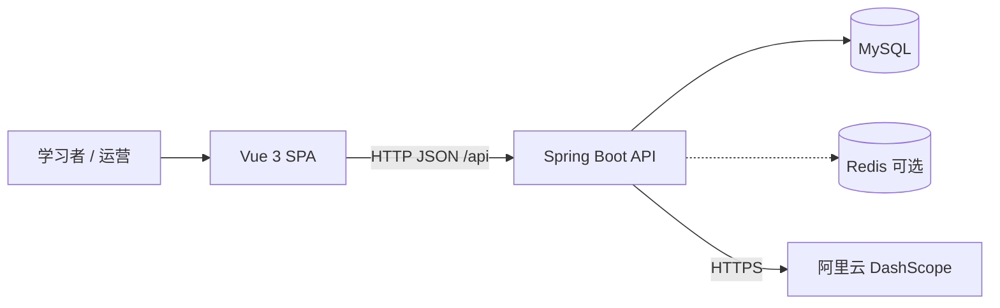
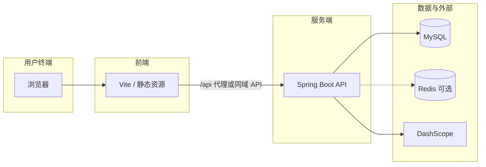

# 系统架构说明

本文档从 **系统上下文**、**逻辑部署** 与 **典型请求链路** 三个层面描述 Speaker 项目架构，便于与 PRD、后端接口文档对照阅读。

---

## 1. 系统上下文（C4 上下文级）

用户通过浏览器访问 **Vue 单页应用**；前端通过 HTTPS/HTTP 调用 **Spring Boot API**；后端读写 **MySQL**，可选连接 **Redis** 做题库缓存；口语/语音/评分能力调用 **阿里云 DashScope（通义）**。

---

## 2. 部署与运行时视图

典型 **开发** 形态：本机同时运行 `npm run dev`（Vite 5173）与 Spring Boot（8080），`vite` 将 `/api` **代理**到后端。

典型 **生产** 形态：静态资源由 Nginx 或 CDN 托管；浏览器直连或通过网关访问 **API 域名**；MySQL 与 Redis 与后端同 VPC 或同机；DashScope 经公网访问。

---

## 3. 典型请求链路（示例）

### 3.1 用户发起口语对练

1. 浏览器直接调用 `POST /api/practice/sessions`，无需登录凭证。
2. 进入 Spring Security 过滤器链：限流 → 请求日志（MDC）→ 管理端 Key 校验（非 admin 路径快速放行）。
3. `PracticeController` → `PracticeService`：使用数据库中最早创建的账号作为单用户数据归属，写 `practice_sessions`、可能读题库表、调用通义生成考官开场。
4. 响应 JSON 返回 `sessionId`、考官台词等。

### 3.2 匿名浏览当季题库

1. `GET /api/bank/seasons` / `GET /api/bank/questions` 无需登录凭证。
2. `BankCatalogService` 命中缓存（内存或 Redis）或查 MySQL。
3. 返回季节列表或按 topic 聚合的题目结构。

---

## 4. 与仓库目录的对应关系

| 目录/模块 | 作用 |
|-----------|------|
| `web/` | 前端 SPA、路由、页面、API 封装（axios）。 |
| `backend/` | Spring Boot 工程、Controller、Service、Mapper、安全配置。 |
| `backend/src/main/resources/db/schema.sql` | MySQL 表结构基线。 |

---

## 5. 文档版本

| 版本 | 日期 | 说明 |
|------|------|------|
| 1.0 | 2026-04-08 | 首版 |
